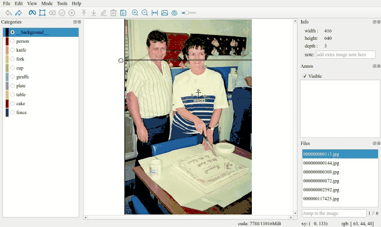

# ISAT with segment anything
# Interactive semi-automatic annotation tool for image segmentation.



The software provides two interfaces, **Chinese** and **English**, which can be switched at any time.

**If this project brings convenience to your work and life, please provide a Star; If you want to contribute code to this project, please send Pull requests**


Quick annotate for image segmentation by [segment anything](https://github.com/facebookresearch/segment-anything)

Demo Video：[youtube](https://www.youtube.com/watch?v=yLdZCPmX-Bc)

演示视频：[bilibili](https://www.bilibili.com/video/BV1Lk4y1J7uB/)

[[中文](../README.md)]         [[English](README-en.md)]

# Feature

- Support interactive semi-automatic annotation based on SAM.
- Support manual creation of polygons.
- Support modifying polygons.
- Support for adjusting polygon occlusion.
- Support preview annotation result.
- Support [**segment-anything-fast**](https://github.com/pytorch-labs/segment-anything-fast).
- Support convert to coco,yolo,labelme and voc for image segment; alse support convert to voc for object detection(xml).
- More features refer to [Features Description](features%20description.md).

# INSTALL
## 1. Run with source code
### (1) Create environment
```shell
conda create -n isat_env python=3.8
conda activate isat_env
```

### (2) Install ISAT_with_segment_anything
```shell
git clone https://github.com/yatengLG/ISAT_with_segment_anything.git
cd ISAT_with_segment_anything
pip install -r requirements.txt
```
**pytorch-gpu need install by [pytorch](https://pytorch.org/) in Windows OS.**

### (3) Download Segment anything pretrained checkpoint.

Download the checkpoint，and save in the path: ISAT_with_segment_anything/ISAT/checkpoints

Now support [SAM](https://github.com/facebookresearch/segment-anything)(support [**segment-anything-fast**](https://github.com/pytorch-labs/segment-anything-fast))，[sam-hq](https://github.com/SysCV/sam-hq)，[MobileSAM](https://github.com/ChaoningZhang/MobileSAM)。

**In windows OS，segment-anything-fast need torch version==2.2.0+dev and other packages. ISAT will support segment-anything-fast when 2.2.0 is stable version in windows OS.**
**If you want use segment-anything-fast，you can install environment from [**segment-anything-fast**](https://github.com/pytorch-labs/segment-anything-fast) .**

|  | pretrained checkpoint | memory | size |
|----|----|----|----|
|    SAM     | [sam_vit_h_4b8939.pth](https://dl.fbaipublicfiles.com/segment_anything/sam_vit_h_4b8939.pth) | 7305M | 2.6G |
|            | [sam_vit_l_0b3195.pth](https://dl.fbaipublicfiles.com/segment_anything/sam_vit_l_0b3195.pth) | 5855M | 2.6G |
|            | [sam_vit_b_01ec64.pth](https://dl.fbaipublicfiles.com/segment_anything/sam_vit_b_01ec64.pth) | 4149M | 375M |
|   sam-hq   | [sam_hq_vit_h.pth](https://huggingface.co/lkeab/hq-sam/blob/main/sam_hq_vit_h.pth)           | 7393M | 2.6G |
|            | [sam_hq_vit_l.pth](https://huggingface.co/lkeab/hq-sam/blob/main/sam_hq_vit_l.pth)           | 5939M | 1.3G |
|            | [sam_hq_vit_b.pth](https://huggingface.co/lkeab/hq-sam/blob/main/sam_hq_vit_b.pth)           | 4207M | 379M |
|            | [sam_hq_vit_tiny.pth](https://huggingface.co/lkeab/hq-sam/blob/main/sam_hq_vit_tiny.pth)     | 1463M |  43M |
| mobile-sam | [mobile_sam.pt](https://github.com/ChaoningZhang/MobileSAM/blob/master/weights/mobile_sam.pt)| 1375M |  40M |

### (4) Run
```shell
python main.py
```

## 2. pip install
### (1) Create environment
```shell
conda create -n isat_env python=3.8
conda activate isat_env
```
### (2) pip install isat-sam
**pytorch-gpu need install by [pytorch](https://pytorch.org/) in Windows OS.**
```shell
pip install isat-sam
```
### (3) Run
```shell
isat-sam
```

## 3. run exe
### (1) download exe
**The version of exe maybe older than source code.**

Download three .zip files, total 2.7G

|        | Download link                                                      |
|--------|-----------------------------------------------------------|
| Baidu Netdisk | link：https://pan.baidu.com/s/1vD19PzvIT1QAJrAkSVFfhg code：ISAT |

Click main.exe to run the tool.

### (2) Download Segment anything pretrained checkpoint.

The download zip files, container sam_hq_vit_tiny.pth, but somebody told the model not support cpu.
You can download [mobile_sam.pt](https://github.com/ChaoningZhang/MobileSAM/blob/master/weights/mobile_sam.pt) to test the tool.

If you want use other models, see[Download Segment anything pretrained checkpoint](https://github.com/yatengLG/ISAT_with_segment_anything/blob/master/docs/README-en.md#3-download-segment-anything-pretrained-checkpoint)

# Use
## 1.Annotate
```text
1. Choice the category in left window of software.
    Edit category in Toolbar-File-Setting.
    
2. Start annotate
    2.1 semi-automatic annotate with SAM.
        Click button named [Segment anything] start annotate(shortcut Q).
        Click interested area with left button of mouse, click uninterested area with right button of mouse, SAM will calcute masks.
    2.2 manual creation of polygons.
        Click button named [Draw polygon] start annotate(shortcut C).
        Click with left button of mouse add point into the polygon.
        Press left button of mouse and drag will auto add point into the polygon, time interval of 0.15 seconds
    2.3 backspace
        Click button named [Backspace] return previous state
(shortcut Z).
3. Click button named [Annotate finished] finish annotate.
(shortcut E).
4. Click button named [Save] write annotations to json file.
(shortcut S).
```
## 2.Modify
```text
1. Polygon modify
    Drag and drop polygon vertices to modify the shape of the polygon.
    Drag the polygon to adjust its position.
2. Category modify
    Chioce the polygon and click button named [Edit] or double click polygon, choice new category in edit window. 
3. Occlusion modify
    Chioce the polygon and click button named [To top](shortcut T) or [To bottom](shortcut B).
4. Delete polygon
    Chioce the polygon and click button named [Delete] to delete the polygon.
```
## 3.View
```text
1. Preview annotation
    Click button named [Bit map], preview semantic and instance annotation result.(shortcut space)
    The order of swithing is polygons-semantic-instance.
2. Image window
    Click Buttons named [Zoom in],[Zoom out],[Fit window](shortcut F)Adjust the size of image.
3. show/hide polygons
    Click button named [Visible] ,show/hide polygons.(shortcut V)
4. mask aplha(only effective when using SAM)
    Drag mask aplha bar to adjust the mask contrast ratio.
```
## 4.Data convert
ISAT have specific format with json.You can use convert tools or convert to other format by yourself.
```text
1. ISAT to VOC
    Convert ISAT jsons to PNG images.
2. ISAT to COCO
    Convert ISAT jsons to COCO json.
3. ISAT to LABELME
    Convert ISAT jsons to LABELME jsons.
4. COCO to ISAT
    Convert COCO json to ISAT jsons.
```
# Contributors

<table border="0">
<tr>
    <td>
    <td>
    <td>...
</td>
</tr>
<tr>
  <td><a href="https://github.com/yatengLG">yatengLG</a>
  <td><a href="https://github.com/Alias-z">Alias-z</a>
    <td><a href="https://github.com/yatengLG/ISAT_with_segment_anything/graphs/contributors">...</a>
</tr>
</table>


# Citation
```text
@misc{ISAT with segment anything,
  title={{ISAT with segment anything}: Image segmentation annotation tool with segment anything},
  url={https://github.com/yatengLG/ISAT_with_segment_anything},
  note={Open source software available from https://github.com/yatengLG/ISAT_with_segment_anything},
  author={yatengLG, Alias-z and horffmanwang},
  year={2023},
}
```
