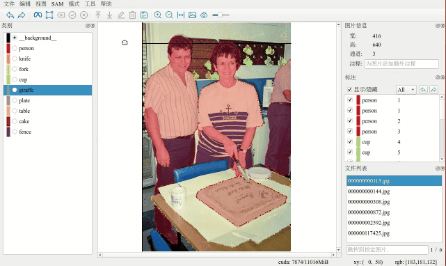
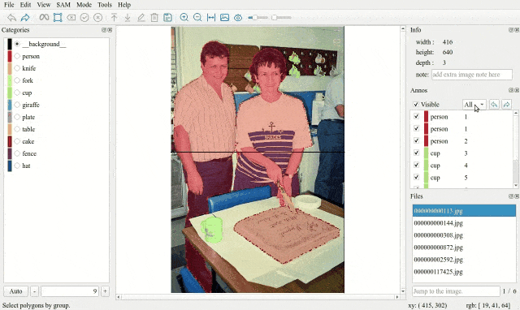
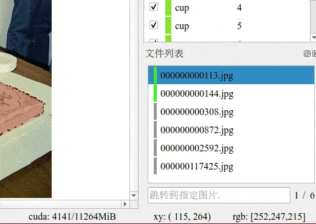

# Menu

1. [Language switching](https://github.com/yatengLG/ISAT_with_segment_anything/blob/master/docs/features%20description.md#1language-switching)
2. [Model switching](https://github.com/yatengLG/ISAT_with_segment_anything/blob/master/docs/features%20description.md#2model-switching)
3. [Contour mode](https://github.com/yatengLG/ISAT_with_segment_anything/blob/master/docs/features%20description.md#3contour-mode)
4. [Occlusion adjustment](https://github.com/yatengLG/ISAT_with_segment_anything/blob/master/docs/features%20description.md#4occlusion-adjustment)
5. [Quick jump to image](https://github.com/yatengLG/ISAT_with_segment_anything/blob/master/docs/features%20description.md#5quick-jump-to-image)
6. [Statusbar information](https://github.com/yatengLG/ISAT_with_segment_anything/blob/master/docs/features%20description.md#6statusbar-information)
7. [Preview annotation result](https://github.com/yatengLG/ISAT_with_segment_anything/blob/master/docs/features%20description.md#7preview-annotation-result)
8. [Import/export config file](https://github.com/yatengLG/ISAT_with_segment_anything/blob/master/docs/features%20description.md#8importexport-config-file)
9. [Drag to draw](https://github.com/yatengLG/ISAT_with_segment_anything/blob/master/docs/features%20description.md#9drag-to-draw)
10. [Quick browsing](https://github.com/yatengLG/ISAT_with_segment_anything/blob/master/docs/features%20description.md#10quick-browsing)
11. [Detail inspection](https://github.com/yatengLG/ISAT_with_segment_anything/blob/master/docs/features%20description.md#11detail-inspection)
12. [Move and delete vertexs](https://github.com/yatengLG/ISAT_with_segment_anything/blob/master/docs/features%20description.md#12move-and-delete-vertexs)
13. [Sam features cache](https://github.com/yatengLG/ISAT_with_segment_anything/blob/master/docs/features%20description.md#13Sam-features-cache)

# 1.Language switching
The software provides two interfaces, Chinese and English, which can be switched at any time.


# 2.Model switching
Switching model in your download models.



# 3.Contour mode
When using SAM for semi-automatic annotation,convert SAM mask to contours by opencv, and then convert contours to polygons.

1. Max only.
```text
Usually,the contour with the highest number of vertices also has the largest area.
Other contours will delete as noise.
```
2. External.
```text
Save external contours, the hole of masks will be filled.
```
3. All.
```text
Save all contours, will add polygons with category __background__ for holes.
```


# 4.Occlusion adjustment
For polygons with overlapping parts,adjustment occlusion with **to top** or  **to bottom**.


# 5.Quick jump to image
Input image name or index to jump the image.


# 6.Statusbar information
Get position and value of pixel. 
If use SAM also show cuda memory in statusbar.


# 7.Preview annotation result
Click **Bit map** button to preview semantic and instance annotation result.


# 8.Import/export config file
Use config file save categories and other args.


# 9.Drag to draw
Keep mouse left button and drag, create polygon like drawing.
You can use click to draw straight line, and use drag to draw curve.


# 10.Quick browsing

Drop down and select group ID to view the target, also support quickly switch between different groups through the scroll wheel.



# 11.Detail inspection
Switch Annotations one by one with group IDs, and at the same time, adapt to the annotation size for easy inspection details.


# 12.Move and delete vertexs
Select vertexs through CTRL, and then move or delete them.


# 13.Sam features cache

Now sam encode features by qthread, so switching images faster when use large model.

Will auto encode features for current image and the prior and the next.(You can adjust it in widgets/mainwindow.py > SegAnyThread > run() )

Add encoding state before file list.
- yello: encoding features
- green: features encoded
- gray:  no features



**The features of image will not be encoded, when the speed switch images faster than the speed of sam encoding. It`s easy to solve, click the image or switch image for sam encoding** 