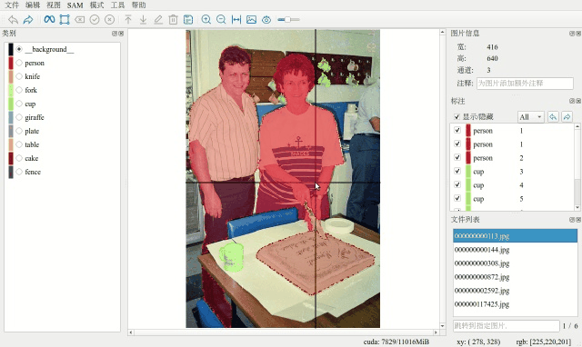

- Language switching
- Model switching
- Contour mode
- Occlusion adjustment
- Quick jump to image
- Statusbar information
- Preview annotation result
- Import/export config file

# 1.Language switching
The software provides two interfaces, Chinese and English, which can be switched at any time.


# 2.Model switching
Switching model in your download models.


# 3.Contour mode
When using SAM for semi-automatic annotation,convert SAM mask to contours by opencv, and then convert contours to polygons.

1. Max only.
```text
Usually,the contour with the highest number of vertices also has the largest area.
Other contours will delete as noise.
```
2. External.
```text
Save external contours, the hole of masks will be filled.
```
3. All.
```text
Save all contours, will add polygons with category __background__ for holes.
```


# 4.Occlusion adjustment
For polygons with overlapping parts,adjustment occlusion with **to top** or  **to bottom**.


# 5.Quick jump to image
Input image name or index to jump the image.


# 6.Statusbar information
Get position and value of pixel. 
If use SAM also show cuda memory in statusbar.



# 7.Preview annotation result
Click **Bit map** button to preview semantic and instance annotation result.


# 8.Import/export config file
Use config file save categories and other args.


